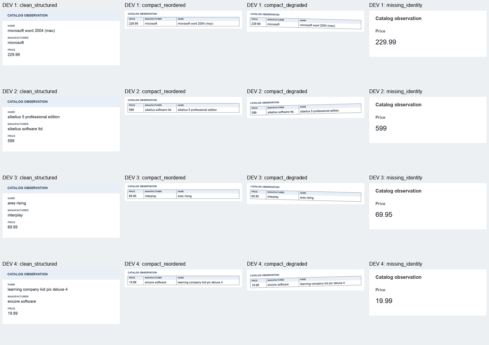

# Source-fact document and OCR controls

These controls test how layout and optical character recognition (OCR) change the observation of fixed product facts. They contain **16 development and 64 test source records**, each shown in four document views. They are synthetic catalog-observation cards made from native Amazon–GoogleProducts records. They are not receipts, merchant documents, new entities, or a sample of document conditions at a national statistical office.

The preparation reads only the frozen `records.json` and `partitions.json` from `products/data/amazon-google/v2/`. It does not read counterpart labels, evaluator metadata, model predictions or linkage outcomes. Within each split, it selects the lowest SHA-256 values of `controls-20261007-v1|split|opaque LEFT record_id`. Source IDs and literal field values remain unchanged.

## Paired conditions

| View | Information shown | Transformation |
|---|---|---|
| `clean_structured` | Original name, manufacturer and price | Labeled catalog card |
| `compact_reordered` | The same three values | Compact table with a different field order |
| `compact_degraded` | The same compact document | Downsample by 0.55; blur radius 0.6 output pixels; rotate by a hash-selected ±1.5 degrees; expand to avoid clipping |
| `missing_identity` | Original price only, with generic document labels | Omit name and manufacturer; no source ID or hidden identity text appears in the pixels |

Descriptions are omitted from **every inference view and both sides of the conventional baseline input**. The untouched five-field source copies, including descriptions, are retained in a file explicitly marked audit-only. This is a separate observed-field ablation from the original product experiment.

All four views of a source record have the same `control_family_id` and split. Development uses stacked sans-serif cards and three-column tables. Test uses label-column serif cards and reordered two-column tables. The layout families differ across splits by design. The existing product-family partition is inherited; 320 views do not represent 320 independent entities, and the distinct real-world entity count was not inferred from hidden labels.

## What is measured here

Installed Tesseract **5.5.3**, English, OEM 1 and PSM 6 processed every image with the same configuration. The raw output is retained without correction. This preparation has produced no model responses, linkage decisions or comparative accuracy measurements.

| Split and view | Records | OCR characters, min / median / max |
|---|---:|---:|
| Development: clean | 16 | 76 / 92 / 134 |
| Development: compact | 16 | 72 / 88.5 / 129 |
| Development: degraded | 16 | 75 / 89.5 / 120 |
| Development: missing identity | 16 | 28 / 32 / 33 |
| Test: clean | 64 | 20 / 20 / 157 |
| Test: compact | 64 | 20 / 47 / 122 |
| Test: degraded | 64 | 20 / 68 / 117 |
| Test: missing identity | 64 | 26 / 32 / 35 |

The test clean-layout median is only 20 characters: this fixed OCR configuration often retains the generic heading and misses the table body. The result is preserved. The degraded view can yield more recognized text than the intact table because resizing changes segmentation. Degradation is a declared image operation, not a guarantee of worse OCR. No template, severity or OCR configuration was selected using linkage performance.

The development contact sheet was visually inspected for intact source values, readable field labels and price-only missing-identity content. The script also verifies that replacing every nonprice field with arbitrary text leaves every missing-identity image's pixels unchanged.



## Inference interfaces

`data/{split}/left-source-no-description.json` and `right-no-description.json` contain exactly the five original inference fields: `record_id`, `name`, `description`, `manufacturer`, and `price`. Descriptions are empty. The right table contains the full corresponding frozen roster: 352 development records or 2,874 test records.

For each view, `data/{split}/{view}/ocr-five-field-rows.json` preserves the original `record_id`, puts all unmodified OCR text into `name`, and leaves `description`, `manufacturer` and `price` empty. No original field value bypasses OCR into these rows. The adjacent `ocr.jsonl` retains the raw text and a separate `view_id`. The manifest maps that condition to its original query ID and source-record group.

The `inputs(split, view)` helper returns one left/right condition. Pass `source_structured` for the no-description structured control. The returned rows can feed the existing product representation and `baseline.run_recordwise` interface. That interface additionally requires explicit extraction entries for every left and right ID, a declared prior bundle, frozen candidates and a separate output directory. This folder does not generate those model extractions or choose a prior.

Use the same no-description right roster in every comparison. For a layout/OCR attribution study, generate and freeze candidates from the no-description structured arm, then reuse them unchanged. `select_fixed_candidates` only filters a caller's list to the selected queries and does not add targets. Reusing the original description-enabled candidate lists would retain extra retrieval information and must be reported as a different information boundary.

Run one condition at a time; do not concatenate the four copies of each `record_id` into a baseline that expects unique IDs. Keep all views together in uncertainty calculations. Separate candidate-restricted comparison from end-to-end retrieval performance.

The price-only condition has the expected evidence state `insufficient_identity_evidence`. Its appropriate action is review/uncertainty. Do not score it as a required identity guess or as a true no-match. A price does not establish unique product identity, even if a small candidate set happens to contain only one occurrence.

## Reproduce and verify

Use an existing Python with Pillow and the installed Tesseract executable. No new dependencies are installed by the script.

```bash
python LLM_basics/nso-semantic-workflows/adversarial-2026/controls/prepare.py
python LLM_basics/nso-semantic-workflows/adversarial-2026/controls/prepare.py --verify
```

The observed source and partition hashes are pinned. The renderer records font hashes, Python/Pillow versions, Tesseract configuration and version, dimensions, PNG hashes, raw pixel hashes, OCR hashes and deterministic degradation recipes. It refuses to overwrite different frozen files. The tested fonts are macOS Arial and Georgia; exact image reproduction on another platform requires those recorded font bytes. Other platforms are not verified.

Individual PNGs are in the ignored `.cache/rendered/` directory. They can be regenerated from the retained records and recipe. The small development contact sheet is retained for inspection. Verification checks every available image hash and all source, ablation, split and OCR invariants. It remains useful without the ignored images, but then does not certify pixels that are absent.

| Artifact | Purpose |
|---|---|
| `protocol.json` | Prospective fields, selection, layouts, OCR and evidence rules |
| `schema.json` | Inference and audit record shapes |
| `data/selection.json` | Exact opaque query IDs and sampling seed |
| `data/source-records-audit-only.json` | Untouched selected observed records; not model input |
| `data/manifest.json` | One recipe, source association and hash bundle per view |
| `data/{split}/` | No-description source/right tables and OCR views |
| `data/runtime.json` | Tested software and font provenance |
| `data/summary.json` | Counts, OCR lengths and aggregate image information |
| `data/dev-contact-sheet.png` | Development-only visual inspection aid |

## Source and licence

Amazon–GoogleProducts is published by the Leipzig University Database Group under [CC BY 4.0](https://creativecommons.org/licenses/by/4.0/), as stated on its [benchmark dataset page](https://dbs.uni-leipzig.de/research/projects/benchmark-datasets-for-entity-resolution). Credit H. Köpcke, A. Thor and E. Rahm, *Evaluation of Entity Resolution Approaches on Real-World Match Problems*, PVLDB 3(1–2), 2010. The [source ZIP](https://dbs.uni-leipzig.de/files/datasets/Amazon-GoogleProducts.zip) and the parent product source notices define the original data provenance.

Changes here are deterministic field omission, rendering, image transformation and OCR. No aliases, descriptions, prices, identities or gold labels were invented. Historical source prices do not describe current inventories. The controls support a bounded mechanism study, not an estimate of operational frequency, staff savings or production linkage quality.
