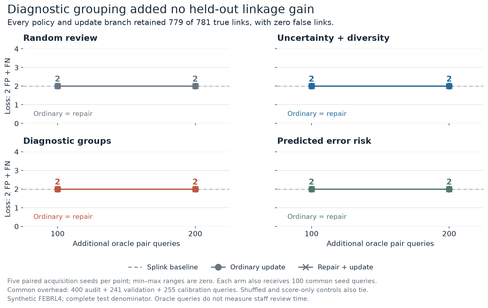
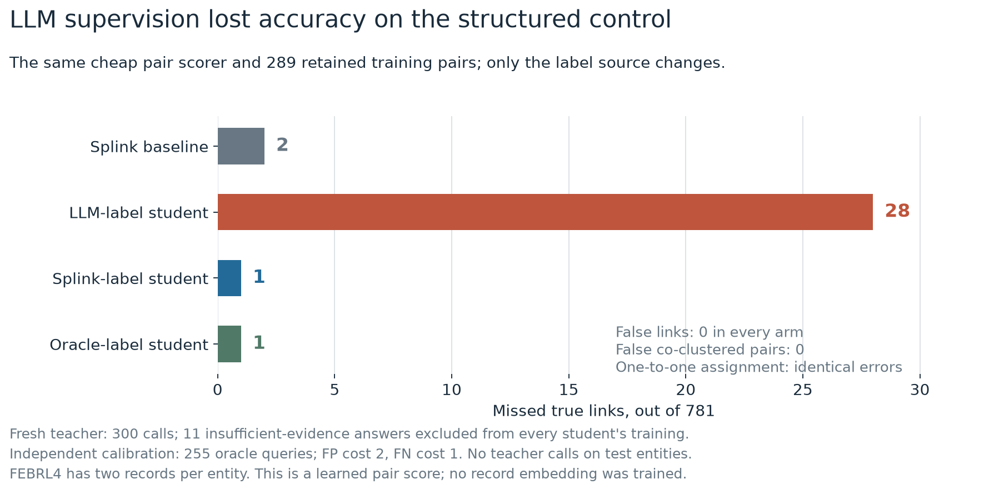
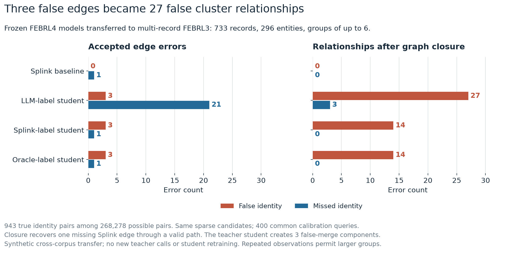

# Measured diagnostic acquisition and reusable similarity

**Diagnostic grouping added no held-out linkage gain on this structured synthetic control.** A fresh LLM-label student lost accuracy. Conventional supervision matched the strongest held-out pair result, but its transfer introduced false graph bridges.

The [single notebook](../../record-linkage-with-semantic-operators.ipynb) presents these experiments alongside the NSO comparisons. This folder supplies their saved tables, figures, protocols and provenance.

## Diagnostic acquisition

The experiment retains a ten-field Splink model nominated by a shared development audit. The official six-field comparison missed nine of 205 audited matches; the ten-field model had no audited errors. Both used unlabeled fitting on the original 3,486 training entities. The audit queried 400 candidate pairs. Adding fields can introduce dependence; the observed audit nominates this particular model without establishing probability calibration elsewhere.

Original validation entities were divided into 450 discovery, 140 repair-validation and 143 calibration entities. The original 781 test entities remained held out from the new fit and selection. Previous teaching work had exposed the original training labels, a 100-entity validation slice and a 20-entity test slice. This public-data pilot is exploratory.

Each acquisition policy receives 100 common seed labels and either 100 or 200 additional labels. The four policies are random, uncertainty with diversity, diagnostic-group coverage and supervised baseline-error risk. Shuffled diagnostic groups and score-only groups are controls. Every policy has the same observed diagnostics, repair library, updater, 20% random quota and five paired acquisition seeds. Each label set is replayed through ordinary updating and repair selection plus updating.

The fixed library supplies name structure, phonetic, combined-address and date-component features. Each arm may select at most two groups from the same eleven proposals. A common 241-pair validation allocation selects repairs; 255 calibration labels select thresholds. These allocations are below the predeclared 400-query ceilings. The updater shrinks additional evidence around the frozen baseline. Oracle queries simulate faithful pair review; no staff time or human adjudication reliability was measured.

The primary illustrative loss is `2 × false links + missed links`. False-link costs 1 and 5 are prespecified sensitivity analyses. The ratios are not operational NSO requirements. An initial development-audit cutoff error was corrected from 1/3 to the appropriate 2/3 before test evaluation. The same audit labels were reused; the original record and correction chronology remain in provenance.

**All policies and both update branches finish with 779 true links, zero false links and two misses among 781 test entities.** All true links are retained by the candidate set; the two misses occur in comparison or decision. The repair selector chooses no additional feature group. Every acquisition seed gives the same accepted links. Paired entity-resampling intervals for policy differences are consequently `[0, 0]`; these describe identical predictions on this corpus and do not establish equivalence on other populations. The audited ceiling limits what this pilot can establish about diagnostic grouping more broadly.



## Reusable pair similarity

A fresh `gpt-6-luna` teacher judges 300 prospectively selected discovery pairs. Only the ten observed synthetic fields enter the prompts. The teacher receives no benchmark identities, fitted score, split or record IDs. Calls use no reasoning, temperature zero and a 256-token output limit, without retries.

Eleven answers report insufficient evidence. All three students train on the same remaining 289 pairs, with the same standardized cheap features and logistic-regression specification. Their labels come respectively from the teacher, the conventional baseline and benchmark truth. The learned object is a reusable pair score. No record embedding is trained. Independent common calibration selects each decision threshold.

| Label source | Training audit TP / FP / FN / TN | Held-out TP | FP | FN |
|---|---:|---:|---:|---:|
| Splink baseline | Not a student | 779 | 0 | 2 |
| LLM teacher | 62 / 0 / 4 / 223 | 753 | 0 | 28 |
| Splink pseudo-labels | 66 / 0 / 0 / 223 | 780 | 0 | 1 |
| Benchmark oracle | 66 / 0 / 0 / 223 | 780 | 0 | 1 |

The teacher loses identity information on these purposefully selected pairs. Its cheaper student also loses held-out recall. Teacher audit accuracy is conditional on the selected pairs and valid decisions. It does not estimate full-population teacher accuracy. The pseudo-label and oracle students recover one of the baseline's two misses, leaving one candidate-supported miss.

All 300 calls returned valid JSON. Measured usage is 93,268 input and 17,927 output tokens. The estimated token price is $0.0182903 against a $0.0772436 reservation. The reservation ceiling was $0.50; the value is not a billing receipt. No test teacher calls were made.



## Multi-record entity clusters

The frozen FEBRL4 model and students transfer to the pinned public FEBRL3 corpus without new teacher inference or student retraining. A whole-entity hash split precedes pairing. Its test contains 733 records, 296 entities and 943 true identity pairs. Group sizes reach six records. The remaining population and split counts are in the [transfer protocol](febrl3-transfer/protocol.json).

The strict-rule prior is estimated from observed records only. Four hundred separately charged calibration queries select thresholds for all methods. Comparisons, student coefficients and standardization remain frozen. Dedupe rank diagnostics acquire a deterministic within-file orientation; this is an additional representation shift. The experiment measures transfer between synthetic corpora, with possible public-model exposure.

| Method | Edge TP / FP / FN | False pairs after closure | Missed true pairs after closure | False-merge components |
|---|---:|---:|---:|---:|
| Splink baseline | 942 / 0 / 1 | 0 | 0 | 0 |
| LLM-label student | 922 / 3 / 21 | 27 | 3 | 3 |
| Splink-label student | 942 / 3 / 1 | 14 | 0 | 3 |
| Oracle-label student | 942 / 3 / 1 | 14 | 0 | 3 |

Connected components recover one absent true candidate through a correct path in the baseline. The teacher student accepts three false edges, which create 27 false co-clustered relationships. This is measured graph damage, separate from the notebook's constructed 50-record bridge example. One-to-one assignment is appropriate for the two-file FEBRL4 control and leaves its errors unchanged. It is inappropriate for repeated FEBRL3 observations.



## Replay and evidence

`replay.py::load_report()` reads the saved outcomes without inference. It returns complete acquisition and student tables, label ledgers and both corpora's results. `figures.py` rebuilds PNG and SVG charts from the same CSV files. `experiment.py` publishes the full fitting, diagnostics, acquisition, update, calibration and evaluation code. `febrl3_experiment.py` publishes the transfer code.

From a fresh repository clone, create a Python 3.11 environment and verify the saved experiment:

```bash
python3.11 -m venv .venv-record-linkage
.venv-record-linkage/bin/python -m pip install -r LLM_basics/nso-semantic-workflows/clustering-study-20261009/requirements.txt
.venv-record-linkage/bin/python LLM_basics/nso-semantic-workflows/clustering-study-20261009/verification.py
```

The verification command checks only published paths and hashes. It reconstructs whole-entity splits and observed diagnostics, checks all 384 outcome rows and graph decisions, and independently refits the three students on their identical saved training pairs. It verifies the common calibration thresholds. It writes no files and makes no teacher calls. Calling `experiment.py` without arguments performs the same read-only verification.

An explicit new-output replay can reconstruct the FEBRL4 fitting and selection workflow using the saved teacher judgments:

```bash
.venv-record-linkage/bin/python LLM_basics/nso-semantic-workflows/clustering-study-20261009/experiment.py preflight --output-dir /tmp/febrl-clustering-replay
.venv-record-linkage/bin/python LLM_basics/nso-semantic-workflows/clustering-study-20261009/experiment.py freeze --output-dir /tmp/febrl-clustering-replay
.venv-record-linkage/bin/python LLM_basics/nso-semantic-workflows/clustering-study-20261009/experiment.py evaluate --output-dir /tmp/febrl-clustering-replay
```

The output directory must initially be absent or empty. These commands preserve the published results and use no paid inference. Reusing already evaluated public data and saved teacher judgments is reproduction, not a new blind confirmation. The transfer module also exposes its scientific functions; the published verification reconstructs its outcomes without downloading data. Verification was tested on macOS with Python 3.11.15 and the pinned packages.

The publication [protocol](study-protocol.json), [freeze record](protocol-freeze.json), [artifact manifest](publication-manifest.json) and [redaction mapping](redaction-provenance.json) retain the methods and hashes. Original scientific seals remain unchanged. The public code replaces process-specific authorization wording with scientific freeze validation. A separate report exporter corrected an absent-seed JSON serialization failure after the CSV outcomes were complete; public code includes the same nullable serialization correction. Neither changed a learner, threshold or prediction.

The experiment completes a bounded comparison and retains its null and adverse results. It establishes neither national-scale throughput nor superiority of semantic supervision. The next research question requires identity evidence that the capable conventional baseline does not already recover.

Sources: [Splink FEBRL4 example](https://moj-analytical-services.github.io/splink/demos/examples/duckdb/febrl4.html), [Splink FEBRL3 example](https://moj-analytical-services.github.io/splink/demos/examples/duckdb/febrl3.html), [FEBRL dataset documentation](https://recordlinkage.readthedocs.io/en/latest/ref-datasets.html). Original ANUOS 1.2 and Splink MIT notices are retained in the [source-data folder](../../record-linkage-tutorial/data).
