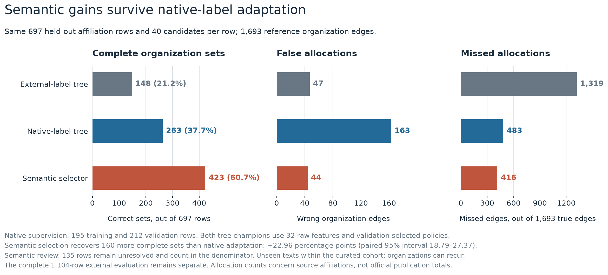

# Native-label adaptation as a secondary control

**Conventional models improve when trained under the native cohort's reference-label convention. The semantic advantage persists on the same held-out texts.** This control tests training-label policy and cohort adaptation as alternative explanations for the external comparison.

The main experiment retains all 1,104 native affiliation rows as an external evaluation. This secondary experiment partitions that same curated cohort. It estimates performance on unseen normalized texts within the cohort. It makes no unseen-organization or production-population claim.

## Frozen comparison

Before native labels were opened, normalized-text duplicate groups were assigned by a fixed hash. Unicode normalization, case folding, accent-mark removal and word-token joining match the main experiment. The first eight SHA256 hexadecimal digits of `native-adaptation-v1:` plus normalized text, modulo 100, assign 0–19 to training, 20–39 to validation and 40–99 to test.

| Partition | Source rows | Normalized duplicate groups | Label use |
|---|---:|---:|---|
| Training | 195 | 190 | Fit candidate-pair models |
| Validation | 212 | 207 | Select thresholds and model champions |
| Test | 697 | 682 | One evaluation after predictions were sealed |

Every method retains the same frozen 40-candidate pool per row. Raw and extracted routes use the main experiment's 19 observed features, logistic regression, gradient-boosted trees and compact/expanded Splink comparisons. The existing 32-feature raw logistic/tree family is also retained. Hyperparameters and the threshold grid match the main protocol. Each route's champion is nominated using validation loss `2 × false edges + missed edges`; all six risk/quality policies and individual model outcomes remain available.

The complete candidate and feature matrices were bound before label access. Both the main and full-feature reference predictions were sealed first. Only the 407 designated training/validation reference sets were then parsed. The secondary test predictions were sealed before its 697 reference sets were parsed. Previously frozen semantic and external conventional outputs are copied onto exactly those test IDs. There are no new model calls, prompts or semantic decision changes.

Extractor review/invalid responses propagate to extracted conventional decisions. Semantic review/invalid responses remain unresolved, emit no automatic edges and remain in the test denominator.

## Same-subset results

The 697 held-out rows have 1,693 reference organization edges. The shared candidates retain 1,548 of them. These denominators differ from the complete 1,104-row external comparison.

| Method | Complete sets | Exact-set accuracy | TP | FP | FN | Review / invalid | Loss `2FP+FN` | Allocation count L1 error |
|---|---:|---:|---:|---:|---:|---:|---:|---:|
| External-label raw champion | 148 / 697 | 21.23% | 374 | 47 | 1,319 | 0 / 0 | 1,413 | 1,348 |
| Native-adapted raw champion | 263 / 697 | 37.73% | 1,210 | 163 | 483 | 0 / 0 | 809 | 594 |
| External-label extracted champion | 188 / 697 | 26.97% | 739 | 82 | 954 | 151 / 2 | 1,118 | 1,008 |
| Native-adapted extracted champion | 201 / 697 | 28.84% | 824 | 56 | 869 | 151 / 2 | 981 | 889 |
| Frozen semantic selector | 423 / 697 | 60.69% | 1,277 | 44 | 416 | 135 / 0 | 504 | 436 |



Native raw supervision raises exact-set accuracy by **16.50 percentage points** against the same-subset external raw champion. The paired 95% interval is **13.39–19.77 points**. It increases false edges while reducing missed targets enough to lower the prespecified weighted loss.

The semantic selector exceeds the native-adapted raw champion by **22.96 percentage points**, with a paired 95% interval of **18.79–27.37 points**. It also has fewer false and missed edges at these frozen operating policies. The adapted raw champion is the 32-feature tree; the adapted extracted champion is the 19-feature tree. They were nominated on validation, not selected from test outcomes.

Within each adapted Fellegi–Sunter family, validation loss nominates the compact name/city/country profile. The expanded profile was also fitted and remains in the complete table.

| Adapted Splink profile | Complete sets / 697 | TP | FP | FN | Loss `2FP+FN` | Allocation count L1 error |
|---|---:|---:|---:|---:|---:|---:|
| Raw compact | 222 | 1,143 | 277 | 550 | 1,104 | 783 |
| Extraction-assisted compact | 235 | 954 | 195 | 739 | 1,129 | 880 |

The extraction-assisted profile has 151 review and two invalid rows. At the strict quality policies, these validation-nominated compact profiles accept zero positive edges on test. They have zero false edges and miss all 1,693 targets. Those adverse policies remain in the table. Method choice depends on the specified false-edge tolerance; the semantic selector's measured gain here concerns the declared risk policy.

Intervals use 2,000 paired normalized-text-group bootstrap draws, stratified by observed source-population mixture. They describe this curated benchmark sample. Shared institutions, possible public-model exposure, reference-label ambiguities and the limited training allocation remain part of the evidence boundary. This control does not separate training-label policy from every other cohort shift.

Allocation error sums absolute differences between automatic and reference source-row counts per organization. These rows are not established unique publications. The values are benchmark allocation errors, not official counts or estimates of population bias. Oracle label access counts available reference sets; no staff annotation time or reliability was measured.

## Public replay and verification

`results.json` contains cohort denominators, validation-nominated champions, every outcome and paired interval. `results.csv` contains all 151 method-policy rows. `predictions.json.gz` preserves every locked test decision. `data/observed-pairs.json.gz` contains the shared candidate evidence and frozen split; training/validation and final-test reference sets are separate files. The protocol and prediction seals retain the access chronology and artifact hashes.

From a repository clone, run the read-only verification:

```bash
python3.11 -m venv .venv-native-adaptation
.venv-native-adaptation/bin/python -m pip install -r LLM_basics/nso-semantic-workflows/native-affiliation-adaptation-20261009/requirements.txt
.venv-native-adaptation/bin/python LLM_basics/nso-semantic-workflows/native-affiliation-adaptation-20261009/verification.py
```

The verifier reconstructs all counts, allocation errors, held-out group membership, ten model fits, validation policies and paired semantic intervals using the published files. It makes no API calls or result writes. The implementation in `experiment.py` exposes the original binding, fitting, sealing and evaluation steps. New execution is explicit; existing output files refuse replacement. Verification was tested on macOS with Python 3.11.15.

[Main external study](../native-affiliation-study-20261009/protocol.json) · [Frozen adaptation protocol](protocol.json) · [Validation policies](validation-policies.json) · [Public artifact manifest](publication-manifest.json).
