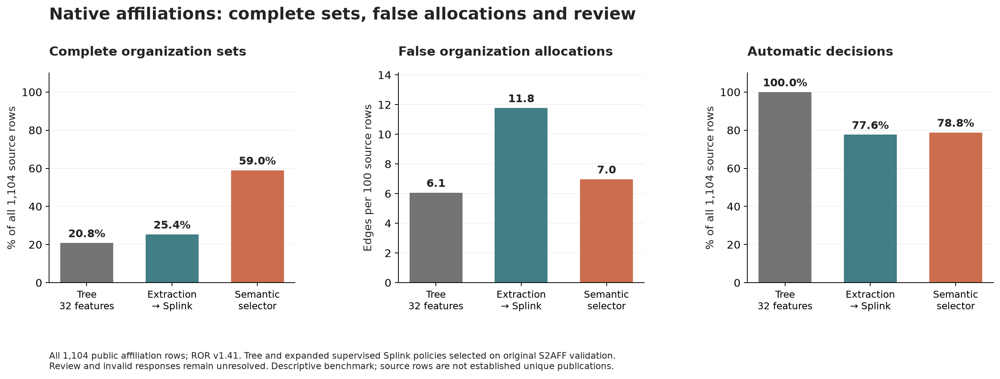
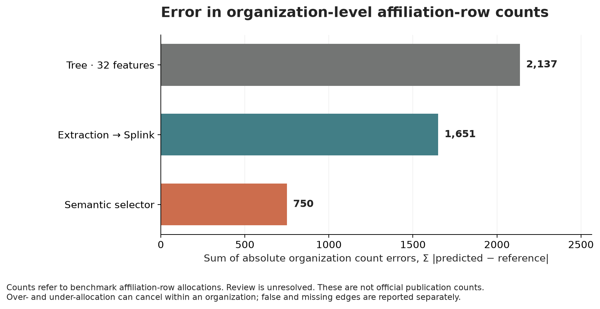
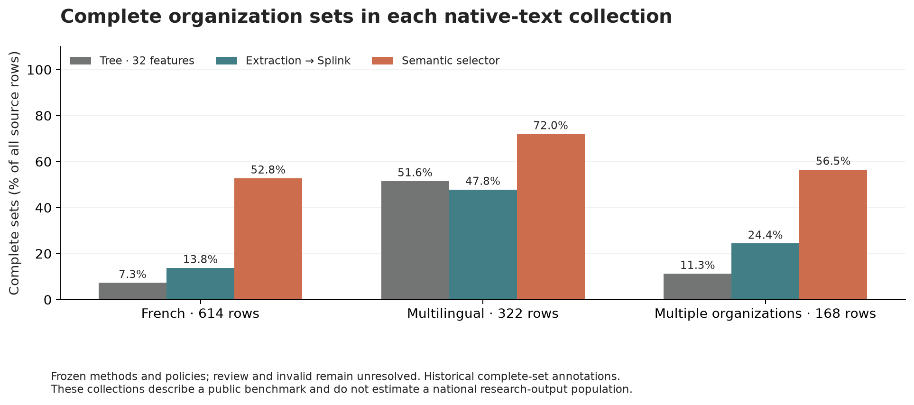

# Native affiliations linked to research organizations

Semantic selection recovered **651 complete organization sets out of 1,104 source rows**, compared with **230** for the validation-selected trained tree. It made 77 false organization assignments and missed 717 reference assignments. The tree made 67 false assignments and missed 2,096. The semantic selector resolved 870 rows automatically; 233 required review and one failed validation.

The measured use is allocating affiliation records to research organizations for institution-level research-output statistics. The records are real published affiliation strings. They are a public benchmark relevant to statistical production, rather than confidential national statistical office records. A source row is not established to be a unique publication.

## Main comparison

All 1,104 native rows are external evaluation inputs. Training uses 1,128 original S2AFF training rows, after normalized input-overlap exclusions. Model policies use original S2AFF validation only. The full 32-feature tree is the raw champion because it minimizes the declared validation loss, `2 × false assignments + missing assignments`. It was selected before native reference labels were opened.

| Frozen method and policy | Complete automatic sets | False assignments | Missing assignments | Automatic rows | Organization-count L1 error |
| --- | ---: | ---: | ---: | ---: | ---: |
| Trained tree, 32 features | 230 / 1,104 | 67 | 2,096 | 1,104 | 2,137 |
| LLM extraction → supervised Splink, expanded profile | 280 / 1,104 | 130 | 1,567 | 857 | 1,651 |
| Semantic selector | 651 / 1,104 | 77 | 717 | 870 | 750 |

The selector's complete-set improvement is **38.13 percentage points**. Its descriptive paired duplicate-group interval is **34.75 to 41.64 points**. False assignments increase by ten against the selected raw tree. The selector's edge losses are lower when a false assignment costs one, two or five missing assignments. All operating policies and adverse results remain in [the complete table](results/summary.csv).

Organization-count L1 error is `Σ_j |predicted_count_j − reference_count_j|`. Each count records how many benchmark affiliation rows were allocated to organization `j`. Review is unresolved. Counts can hide swaps between source rows, so false and missing assignment counts remain alongside this aggregate measure. These results do not estimate official publication counts or population bias.





## Three source collections

| Source collection | Rows | Semantic complete automatic sets | Trained-tree complete sets |
| --- | ---: | ---: | ---: |
| French affiliations | 614 | 324 | 45 |
| Multilingual affiliations | 322 | 232 | 166 |
| Unrelated multiple organizations | 168 | 95 | 19 |



These are three curated challenge collections for the same organization-linkage relation. They are not three independent samples of national statistical-office operations. The [AffilGood paper, §3.3](https://aclanthology.org/2024.sdp-1.13/) defines its reference policy: every explicitly named organization is included at its annotated ROR level. Substituting a parent or child organization is an error. The three native sources contain 2,706 reference organization assignments, including 168 inactive and nine withdrawn registry entries. There are 65 rows without a reference ROR target, 350 single-target rows and 689 multiple-target rows.

The original S2AFF training labels have a different historical annotation policy and a different target-cardinality distribution. A [separately frozen native adaptation comparison](../native-affiliation-adaptation-20261009/) tests this alternative with native training and validation partitions. Its predictions were sealed before either evaluator opened the adaptation test outcomes. The main 1,104-row external evaluation remains unchanged.

## Candidate and mechanism controls

The complete ROR v1.41 registry contains 108,476 organizations. Candidate retrieval uses Unicode-preserving character and word TF-IDF, names, aliases, acronyms, multilingual labels and observed geography. No reference target is inserted. Candidate-blind extraction runs before registry retrieval. Every selection method then receives the same final 40 candidate IDs per query.

The frozen union and reranking step limits the comparison. Raw retrieval retains 87.3% of reference targets; extraction retrieval retains 96.5%; the final common pool retains 91.2%. All targets survive for 79.3% of positive rows in that common pool. Reranking and truncation therefore discard some targets available in the extraction-only list. A selector cannot repair those omissions. These outcomes are retained without changing the candidate rule after scoring.

Fifteen conventional arms each retain six validation-selected policies. They include lexical sets, logistic and tree models, compact and expanded supervised Fellegi–Sunter profiles, the earlier complete 32-feature family, and extraction-assisted versions. Matched raw controls use identical training-row weights and the same 100-row validation panel as the extraction arms. This separates extraction from changes in weighting or calibration access.

The extraction mechanism is mixed. Against the matched raw route, extraction increases tree complete-set accuracy by 2.99 points and expanded Splink accuracy by 11.78 points. Compact Splink decreases by 2.45 points; logistic accuracy is unchanged. Expanded Splink's gain also adds false assignments. The main selector result supports this measured pipeline and task; it does not establish superiority over every Fellegi–Sunter implementation or every linkage relation.

Splink 5.0.0 fits supervised match probabilities with `estimate_m_from_pairwise_labels`. Comparison evidence is precomputed from the permitted text and registry fields. Candidate-conditional nonmatch probabilities and priors use training pairs. Declared half-count smoothing handles sparse levels. Saved effective probabilities agree with native Splink inference on 200 pairs per fitted model within `1e-10`. Fit parameters, sparse levels and native settings remain in [the audit](results/fit-audit.json).

## Provenance, cost and verification

The method protocol, prompts, source hashes, old-data extraction sample and feature grids were frozen before calls. The candidate pools, trained models, validation-selected policies and all predictions were sealed before native label access. The adaptation then opened only its declared training and validation labels and sealed its test predictions. Main evaluation-stage label access is timestamped separately.

The model was `gpt-6-luna`, with no reasoning, temperature zero, a 1,024-token output cap and no automatic retries. All 2,508 jobs were attempted once. The token-price estimate is **$0.402793**, with **$2.272191** permanently reserved under the $3 cap. This is provider token accounting at the checked standard prices, not a billing receipt. Public affiliation text and public registry metadata are the API inputs. [Official pricing](https://developers.openai.com/api/docs/pricing) was checked on 9 October 2026; extraction and selection phase payload estimates are retained.

The benchmark has 1,079 normalized duplicate-text groups. Four groups contain conflicting reference sets; they remain in the analysis. There are no normalized native-text overlaps with the old training/validation inputs, but 344 native rows share at least one training organization. Public model exposure is possible. The uncertainty calculation resamples duplicate groups and describes these benchmark collections; it does not establish unseen-organization or national-population performance.

An independent audit rebuilt native truth directly from the three publisher CSVs. It verified 35 sealed hashes, 91 method/policy outputs, 1,638 metric-view/group rows, 364 allocation rows, candidate recall and the label-access chronology. See [independent verification](results/independent-count-verification.json), [local replay checks](results/verification.json), [reference-policy audit](results/reference-policy-audit.json) and [full results](results/evaluation.json).

Offline replay and figure rendering passed on Python 3.11.15 / macOS 26.6.2 ARM64 on 9 October 2026. Other platforms were not tested. [environment.json](environment.json) records versions; [requirements.txt](requirements.txt) pins the packages used.

From the repository root, this read-only verification command uses Python's standard library and the published files. It requires no original cache, installed study packages, network access or API key:

```bash
python3 -B LLM_basics/nso-semantic-workflows/native-affiliation-study-20261009/verification.py
```

It checks the original scientific seals and source hashes, reconstructs native truth from the publisher CSVs, verifies all 91 method/policy outputs and organization-allocation counts, and checks the label-access chronology. It preserves the saved bootstrap intervals without rerunning resampling. The exact pinned S2AFF CSV and Apache notice are published in [sources/](sources/); [the source binding](sources/source-binding.json) changes only the verifier's source location. The frozen experiment code and seals remain unchanged. A publication-only fixture without any cache passed this command with zero file writes on 9 October 2026; see [publication verification](results/publication-verification.json).

To regenerate the three figures from saved results, using the pinned study environment:

```bash
.venv/bin/python LLM_basics/nso-semantic-workflows/native-affiliation-study-20261009/render_figures.py
```

The original source notices remain in [the organization source package](../adversarial-2026/organizations/notices/). Cite Duran-Silva, Accuosto, Przybyła and Saggion, *AffilGood: Building reliable institution name disambiguation tools to improve scientific literature analysis*, SDP 2024. ROR metadata are CC0; the original GeoNames attribution is retained. Original scientific evidence was not modified.
